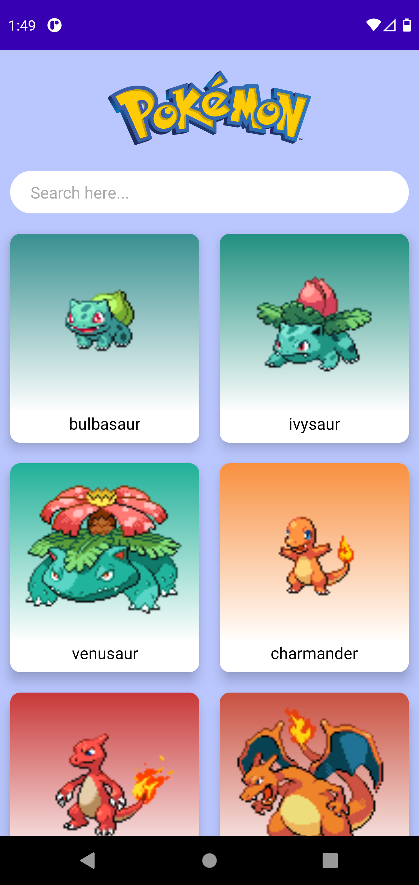
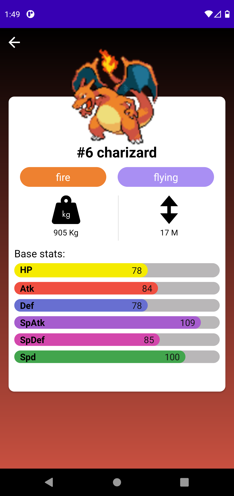

# PokeDex - Android App

## Screenshots

### [Video Demo](https://drive.google.com/file/d/1_rGTj7t5jCmb0hGUv52a1dGurNeJJZMd/view?usp=sharing)

## Libraries Used

- Retrofit
- Kotlin Coroutines
- Paging 3
- Glide
- Lifecycle
- Hilt (Dependency Injection)

## Special thanks ❤️...

I would like to thank [pokeapi](https://pokeapi.co/) for providing Pokemon API which helped me a lot to develop this application.
